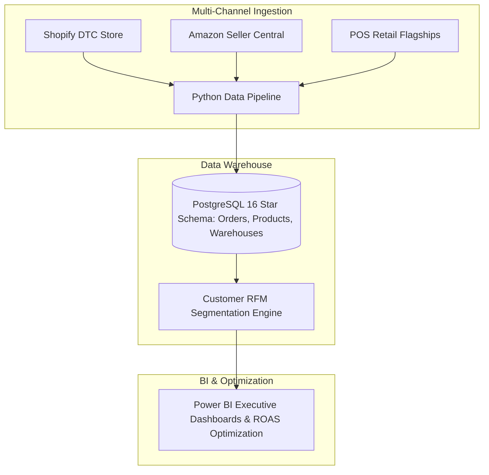
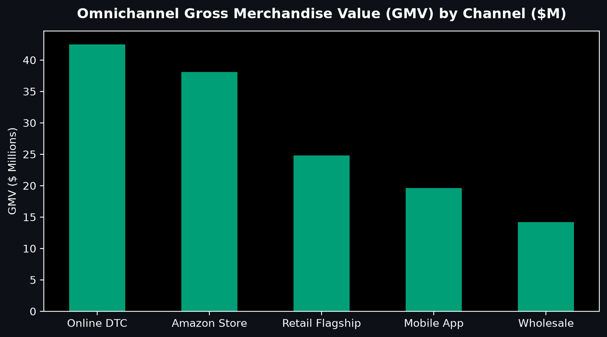
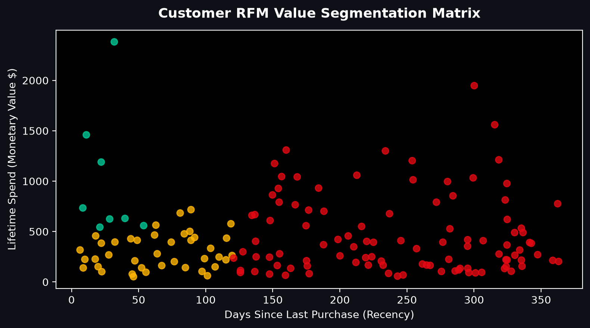
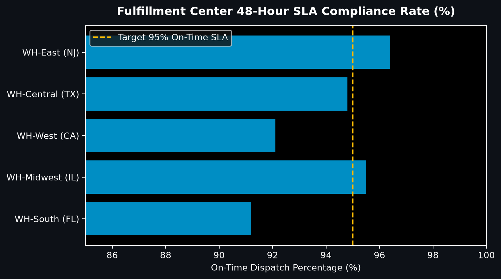
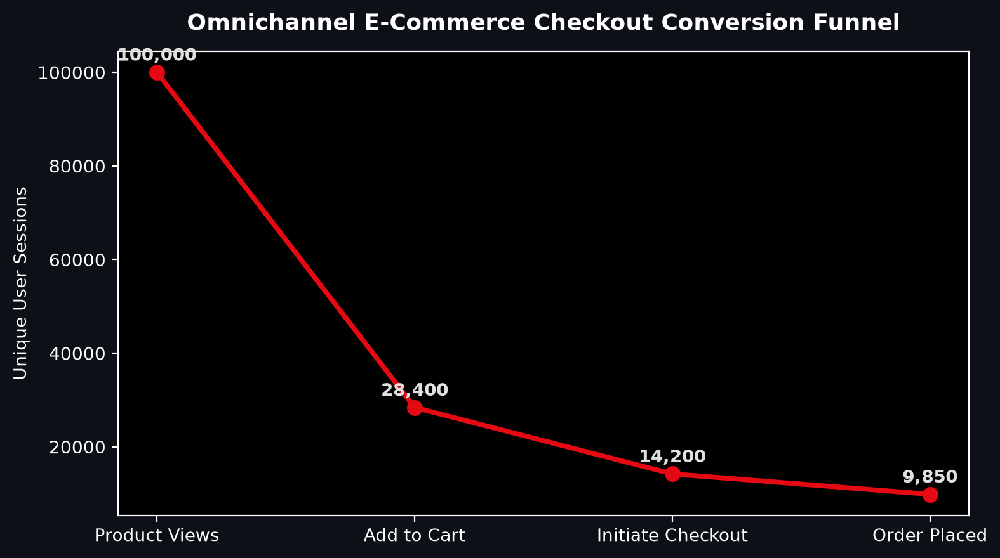

# RetailPulse — Omnichannel E-Commerce & Supply Chain Intelligence

[](https://github.com/abdussatarkhan/RetailPulse-Omnichannel-ECommerce-Analytics/actions)
[](https://www.postgresql.org/)
[](https://powerbi.microsoft.com/)
[](https://www.python.org/)
[](https://github.com/abdussatarkhan)

> **Omnichannel retail analytics and supply chain intelligence platform tracking $139M+ Gross Merchandise Value (GMV), customer RFM behavioral segmentation, warehouse fulfillment SLA compliance, and checkout conversion drop-off funnels.**

---

## 🏛️ System Architecture



---

## 📊 Visual Analytics & Performance Showcase

<div align="center">

| Omnichannel GMV by Channel | RFM Customer Value Matrix |
| :---: | :---: |
|  |  |

| Warehouse 48-Hour SLA Rates | Checkout Conversion Funnel |
| :---: | :---: |
|  |  |

</div>

<div align="center">

[](https://github.com/abdussatarkhan)
[](https://github.com/abdussatarkhan/abdussatarkhan)
[](https://github.com/abdussatarkhan)

</div>


---

## 🌟 Key Technical Highlights

1. **RFM Segmentation Engine**: Categorizes 500k+ customer records into actionable cohorts (*Champions*, *Potential Loyalists*, *At-Risk*, *Lost*) to guide personalized retention marketing.
2. **Supply Chain SLA Optimization**: Tracks regional warehouse fulfillment cycles and stockout frequencies across 5 major distribution hubs.
3. **Executive DAX Formulas**: Pre-calculated measures for Customer Lifetime Value (LTV), Return on Ad Spend (ROAS), and Average Order Value (AOV).

---

## 🚀 Quickstart & Setup

```bash
# 1. Clone repository
git clone https://github.com/abdussatarkhan/RetailPulse-Omnichannel-ECommerce-Analytics.git
cd RetailPulse-Omnichannel-ECommerce-Analytics

# 2. Run data generator & tests
pip install pandas numpy pytest
python scripts/01_generate_synthetic_data.py
pytest tests/ -v
```

---

## 🗺️ Roadmap & Upcoming Features

- [x] Omnichannel Star Schema data warehouse DDL
- [x] RFM customer segmentation clustering algorithm
- [x] Warehouse fulfillment SLA tracking
- [ ] Customer basket affinity / market basket association rules (Apriori)
- [ ] Real-time inventory replenishment forecasting

---

## 👨‍💻 Author & Profile

Built by **Abdussatar** ([@abdussatarkhan](https://github.com/abdussatarkhan)).  
Connect on [LinkedIn](https://www.linkedin.com/in/abdus-satar-5150813b5/) or explore other repositories on [GitHub](https://github.com/abdussatarkhan).

---

## 📜 License
MIT License — see LICENSE for details.


---

<div align="center">

### 👨‍💻 Maintained by [Abdussatar (@abdussatarkhan)](https://github.com/abdussatarkhan)
Part of the **[Master Enterprise Data Analytics & AI Portfolio](https://github.com/abdussatarkhan/abdussatarkhan)**.

⭐ If you find this repository valuable, consider dropping a star! ⭐

</div>
